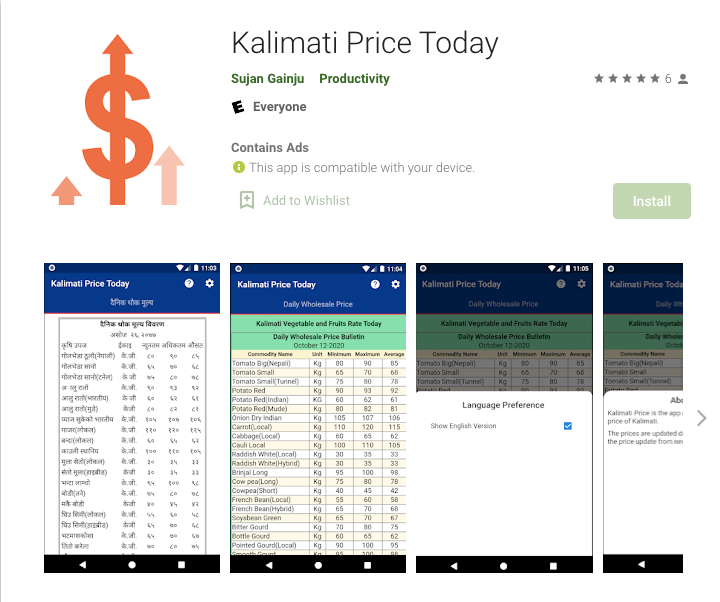
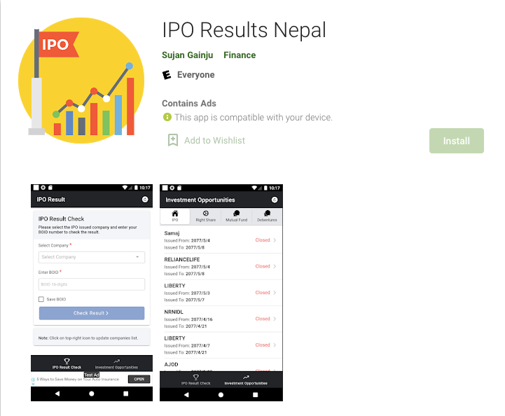
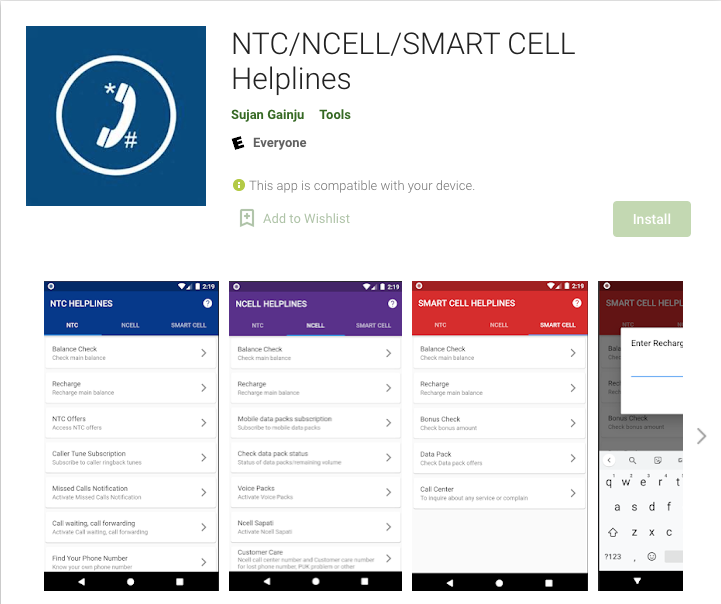
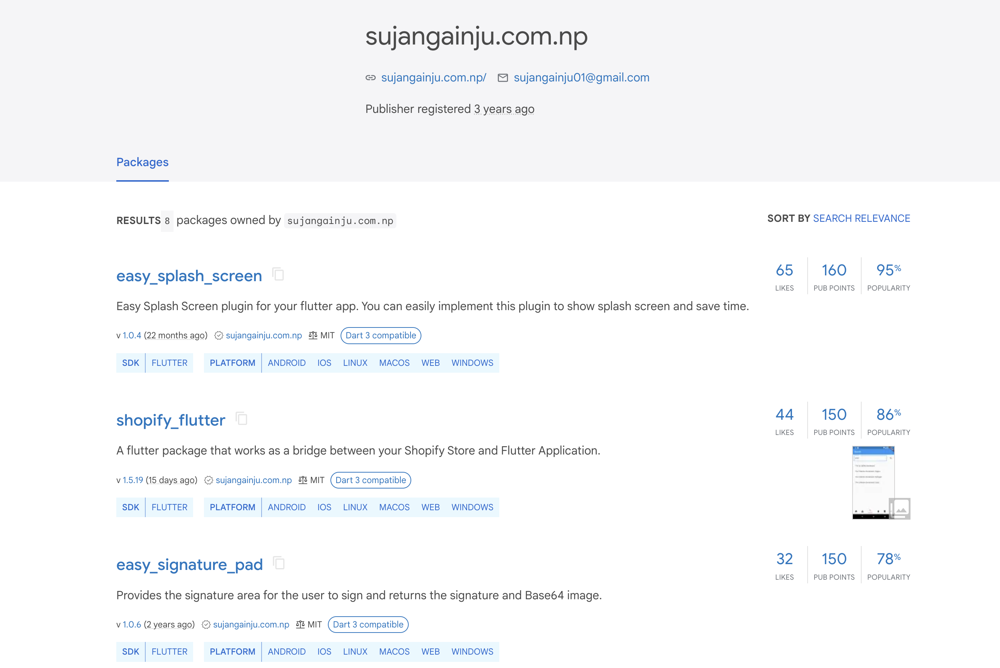
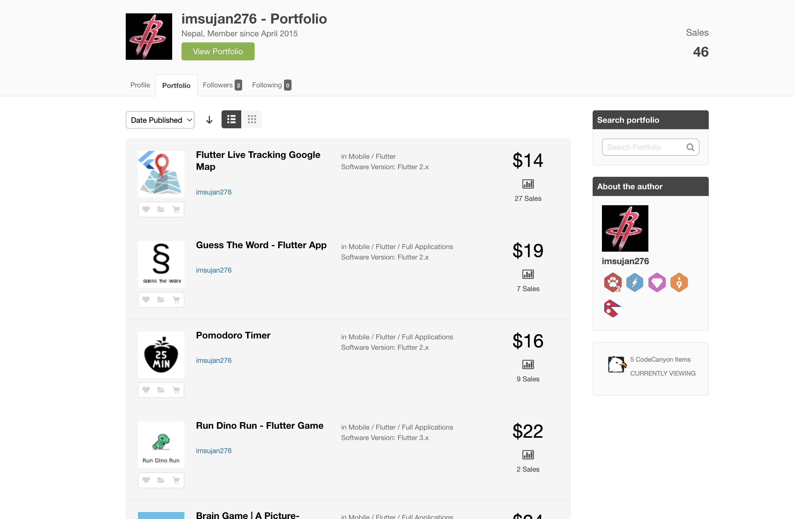

---
title: Er. Sujan Gainju - Computer Engineer | Flutter Developer | Freelancer
layout: template
filename: index.md
--- 

  

    <!-- /Header -->
    <!-- Arrows Nav -->
    

      
<i class="lnr lnr-chevron-left"></i>

      
<i class="lnr lnr-chevron-right"></i>

    

    <!-- /Arrows Nav -->
    <!-- Main Content -->
    

      <!-- Page changer wrapper -->
      

        <!-- Subpages -->
        

          <!-- Home Subpage -->
          <section class="pt-page" data-id="about-me">
            

              

                

                  

                    

                      

                    

                  

                  

                    

                      

                        

                          

                          <h2 class="hp-main-title"><a href="#">Sujan Gainju</a></h2>
                            <ul>
                              <li> Flutter App Developer </li>
                              <li> Computer Engineer</li>
                              <li> Freelancer</li>
                            </ul>
                          

                          

                          
                           
                          

                            <a href="https://www.linkedin.com/in/sujan-gainju-415147114" target="_blank" style="flex: 1; text-align: center;"><i class="fab fa-linkedin"></i></a>
                            <a href="https://github.com/imsujan276" target="_blank" style="flex: 1; text-align: center;"><i class="fab fa-github-square"></i></a>
                            <a href="https://play.google.com/store/apps/dev?id=6505221814874321222" target="_blank" style="flex: 1; text-align: center;"><i class="fa fa-trophy"></i></a>
                            <a href="mailto:sujangainju01@gmail.com" target="_blank" style="flex: 1; text-align: center;"><i class="fa fa-envelope"></i></a>
                          

                          

                        

                         
                        <!-- <h2 class="hp-main-title"><a href="#">Sujan Gainju</a></h2> -->
                        

                          I am <strong>Sujan Gainju</strong>, a passionate mobile app developer specializing in Flutter, based in Bhaktapur, Nepal. With a solid foundation in computer science and a deep commitment to mastering mobile technologies, I craft sleek, responsive, and high-performance mobile applications that stand out in today’s competitive app market. My journey in app development started from a curiosity to solve real-world problems through technology, leading me to embrace Flutter for its efficiency and versatility. This powerful framework allows me to create cross-platform applications that provide a seamless user experience across both Android and iOS devices.
                        

                        

                          In my development process, I focus on delivering robust and scalable solutions that align with client needs and exceed user expectations. My portfolio spans a diverse range of projects, from consumer-facing apps to complex business solutions, all marked by a commitment to quality and innovation. I thrive on tackling challenging problems and continuously updating my skills to stay ahead of industry trends. By blending technical acumen with a user-centered design approach, I aim to build applications that not only function flawlessly but also engage and delight users. Whether you’re looking for a full-fledged app or need to enhance an existing one, my expertise in Flutter development ensures that your vision is realized with precision and excellence.
                        

                      

                    

                  

                

              

            

            

            

              

                <!-- Services Block Title -->
                

                  

                    

                      

                        <h3>What I Do</h3>
                      

                    

                  

                

                <!-- /Services Block Title -->
                <!-- Services Block -->
                

                  

                    

                      

                        <!-- Service Item 1 -->
                        

                          

                            <i class="lnr lnr-code"></i>
                          

                          

                            <h4>Programming</h4>
                            
I like to program in my free time, learn new stuff that helps me to understand and
                              improve my programming skills.

                          

                        

                        <!-- /Service Item 1 -->
                        <!-- Service Item 2 -->
                        

                          

                            <i class="lnr lnr-license"></i>
                          

                          

                            <h4>Proactive</h4>
                            
 I like to read articles in medium, do courses, and create projects. The objective is to
                              use what I learn in a real-world problem.

                          

                        

                        <!-- Service Item 2 -->
                      

                    

                  

                  

                    

                      

                        <!-- Service Item 3 -->
                        

                          

                            <i class="lnr lnr-flag"></i>
                          

                          

                            <h4>Time Management</h4>
                            
I'm a very organizational person, I like to work by tasks or objectives, know what is the
                              next step in the process to complete the work with quality. I like to use agile for
                              software development.

                          

                        

                        <!-- Service Item 3 -->
                        <!-- Service Item 4 -->
                        

                          

                            <i class="lnr lnr-users"></i>
                          

                          

                            <h4>Teamwork </h4>
                            
I enjoy working with a team, the process of solving every problem is important to deliver
                              a good quality product. Each member of the team has the opportunity to give ideas and
                              share knowledge.

                          

                        

                        <!-- Service Item 4 -->
                      

                    

                  

                

                <!-- /Services Block -->
              

            

          </section>
          <!-- End of Home Subpage -->
          

         <!-- Resume Subpage -->
         <section class="pt-page" data-id="resume">
          

            

              <h2 class="section-title">Resume</h2>
              <h5 class="section-description">5+ Years of Experience</h5>
            

            

              <!-- 
 -->
                

                  

                    

                      <h3>Education</h3>
                    

                    

                      

                        

                          <h5 class="item-period">2012- 2017</h5>
                          Khwopa Engineering College
                        

                        

                          <h4 class="item-title">B.E Computer Engineering</h4>
                          
Bachelor's degree in the Khwopa Engineering College major in compueter application

                        

                      

                    

                    

                    

                      <h3>Experience</h3>
                    

                    

                      

                        

                          NerdPlatoon Pvt. Ltd.
                          <h5 class="item-period">Jan 2018 - Present</h5>
                        

                        

                          <h5 class="item-title">Mobile Application Engineer</h5>
                          <ul type="A">
                            <li type="circle">Responsible to design and develop the hybrid mobile application for the vehicle dealers and it customers.</li>
                            <li type="circle">Resposible for implementing the UI/UX and deplying it to the app stores and play stores.</li>
                            <li type="circle">Developed Flutter plugins for the project.</li>
                            <li type="circle">Handled multiple projects at the same time.</li>
                            <li type="circle">Hands on experience with Firebase</li>
                            <li type="circle">Push Notification implementation.</li>
                            <li type="circle">In-App Purchase implementation.</li>
                            <li type="circle">Google map integration.</li>
                            <li type="circle">Custom and complex UI implementation.</li>
                            <li type="circle">Google Admob integration.</li>
                            <li type="circle">DeepLinking implementation.</li>
                          </ul>
                        

                      

                    

                      

                        

                          <h5 class="item-period">02/2025 – Present</h5>
                          Phluid World
                        

                        

                          <h4 class="item-title">Consultant (Flutter)</h4>
                          <ul type="A">
                            <li type="circle">Consulted the devlopers on the project and helped them to implement the logic.</li>
                            <li type="circle">Involved in bug fixing</li>
                            <li type="circle">Communication with QA team to resolve the issues.</li>
                            <li type="circle">Provided the solution for the issues the developers are facing.</li>
                          </ul>
                        

                      

                    

                      

                        

                          <h5 class="item-period">12/2021 – 08/2022</h5>
                          Frntlne
                        

                        

                          <h4 class="item-title">Flutter Developer</h4>
                          <ul type="A">
                            <li type="circle">Actively involved in the project development.</li>
                            <li type="circle">Involved in bug fixing</li>
                            <li type="circle">UI/UX implementation</li>
                            <li type="circle">Designed mockup for the project.</li>
                          </ul>
                        

                      

                    

                  

                

                

                

                  

                      

                        <h3>Programming Skills</h3>
                      

                      

                        <!-- Skill 5 -->
                        

                          <strong>Flutter</strong>
                          

                            <strong>Dart</strong>
                          

                        

                        <!-- /Skill 5 -->
                        <!-- Skill 6 -->
                        

                          <strong>Firebse</strong>
                          

                            <strong>REST API</strong>
                          

                        

                        <!-- /Skill 6 -->
                        <!-- Skill 7 -->
                        

                          <strong>SQL</strong>
                          

                            <strong>Pyhton</strong>
                          

                        

                        <!-- /Skill 7 -->
                        

                          <strong>Go</strong>
                        

                      
å
                  

                

              <!-- 
 -->
            

          

        </section>
        <!-- End of Resume Subpage -->
          

          <!-- Portfolio Subpage -->
          <section class="pt-page" data-id="portfolio">
            

              

                <h2 class="section-title">Portfolio</h2>
              

              

                

                  

                      <!-- Portfolio Grid -->
                      

                        <figure class="item standard" data-groups='["category_all", "category_android"]'>
                          

                            
                          

                          <i class="fa fa-file-alt"></i>
                          <h4 class="name"><a href="https://play.google.com/store/apps/details?id=com.suga.kalimati_price"
                              target="_blank">Kalimati Price Today</a></h4>
                          Android
                        </figure>
                        <figure class="item standard" data-groups='["category_all", "category_android"]'>
                          

                            
                          

                          <i class="fa fa-file-alt"></i>
                          <h4 class="name"> <a href="https://play.google.com/store/apps/details?id=np.com.sujangainju.iporesultnepal"
                              target="_blank">IPO Results Nepal</a></h4>
                          Android
                        </figure>
                        <figure class="item standard" data-groups='["category_all", "category_android"]'>
                          

                            
                          

                          <i class="fa fa-file-alt"></i>
                          <h4 class="name"><a href="https://play.google.com/store/apps/details?id=np.com.sujangainju.iporesultnepal"
                              target="_blank">NTC/NCELL/SMART CELL Helplines</a></h4>
                          Android
                        </figure>
                        <figure class="item standard" data-groups='["category_all", "category_android"]'>
                          

                            
                          

                          <i class="fa fa-file-alt"></i>
                          <h4 class="name"><a href="https://pub.dev/publishers/sujangainju.com.np/packages/" target="_blank"
                              >Flutter Packages</a></h4>
                          Flutter, pub.dev
                        </figure>
                        <figure class="item standard" data-groups='["category_all", "category_android"]'>
                          

                            
                          

                          <i class="fa fa-file-alt"></i>
                          <h4 class="name"><a href="https://codecanyon.net/user/imsujan276/portfolio?direction=asc&order_by=sortable_at/" target="_blank">Envato Portfolio</a></h4>
                          Flutter, Marketplace
                        </figure>
                      

                    

                    <!-- /Portfolio Content -->
                  

                

              

            <!-- 
 -->
          </section>
          <!-- /Portfolio Subpage -->
          

          <!-- Contact Subpage -->
          <section class="pt-page" data-id="contact">
            

              

                <h2 class="section-title">Contact</h2>
                <h5 class="section-description">Get in Touch</h5>
              

              

                

                  <!-- 

                    

                      

                        <i class="lnr lnr-phone-handset"></i>
                        <h4><a href="tel:+9779849170030">(+977) 9849170030</a></h4>
                        å
                        
                      

                    

                  
 -->
                  

                    

                      

                        <i class="lnr lnr-map-marker"></i>
                        <h4>Bhaktapur, Nepal</h4>
                        
                        
                      

                    

                  

                  

                    

                      

                        <i class="lnr lnr-envelope"></i>
                        <h4><a href="mailto:sujangainju01@gmail.com">sujangainju01@gmail.com</a></h4>
                        
                        
                      

                    

                  

                  

                    

                      

                        <i class="lnr lnr-checkmark-circle"></i>
                        <h4>Freelance Available</h4>
                        
                        
                      

                    

                  

                

              

              

                

                  

                    

                      <h3>A job opportunity?</h3>
                      <h4>Send me an email to: <a href="mailto:sujangainju01@gmail.com">sujangainju01@gmail.com</a></h4>
                    

                  

                

              

            

          </section>
          <!-- End Contact Subpage -->
        

      

      <!-- /Page changer wrapper -->
    

    <!-- /Main Content -->
  

